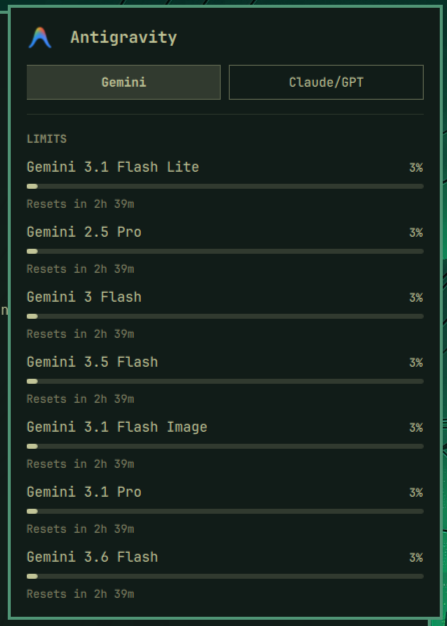

# Antigravity Usage Widget for Omarchy



This is a custom Omarchy Shell plugin that pulls your live Antigravity API quotas directly from Google and displays them in a beautiful, compact dropdown menu directly in your top bar.

## Features
- **Live Sync**: The UI automatically queries the internal Google API every 60 seconds to pull your true usage quota.
- **Auto-Grouping**: Automatically categorizes your usage into Gemini and Claude/GPT tabs.
- **Native Look**: Renders natively within the Omarchy shell using QML, meaning zero electron overhead.
- **High-Res Logo**: Uses the official, true Antigravity app drawer logo.

## Installation

### 1. Install the Plugin
Omarchy has built-in support for cloning Git repositories as plugins. Simply run:
```bash
omarchy plugin add https://github.com/overclock98/antigravity-usage-widget
```

### 2. Enable it
```bash
omarchy plugin enable antigravity.usage
```

Enjoy!
